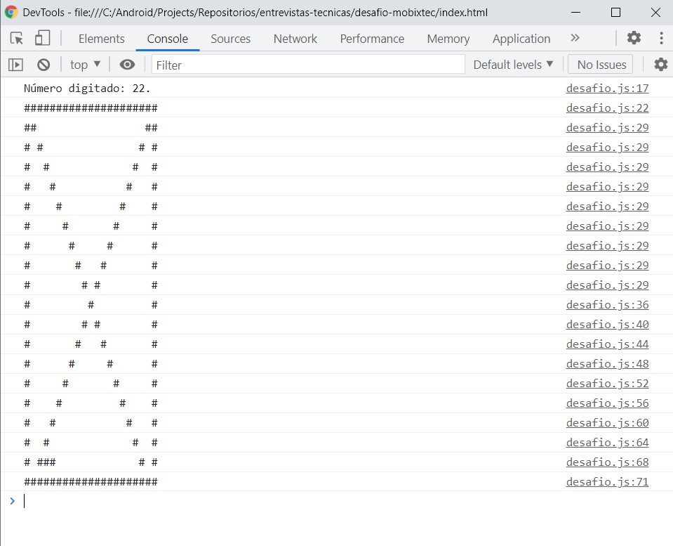
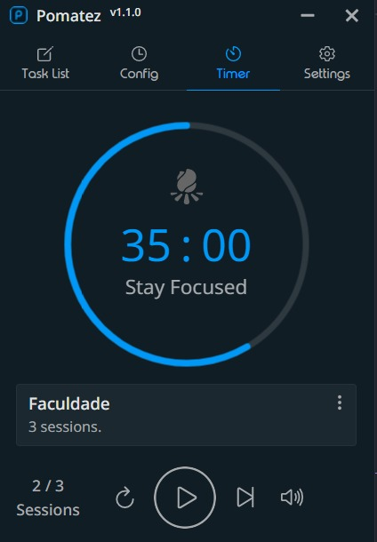
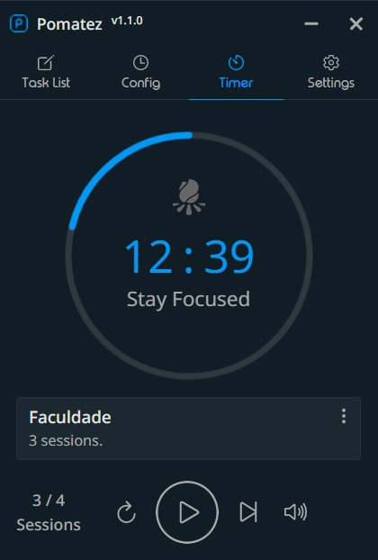

# Desafio de Lógica - Mobixtec

Fase de teste lógica de programação para a vaga na empresa Mobixtec.

## Guia de leitura

* [Ampulheta](#ampulheta)
  - [Como usar](#como-usar)
* [Tecnologias utilizadas](#tecnologias-utilizadas)
* [Relatório](#relatório)
* [Desenvolvedor](#desenvolvedor)
* [Agradecimentos](#agradecimentos-)

## Ampulheta

Sistema de ampulheta desenvolvido que preenche, no console, a metade inferior dela de acordo com o número inserido no Prompt pelo usuário.

  

### Como usar

Siga instrução abaixo para executar o sistema na sua máquina.

#### Página do projeto

  
Como consigo visualizar a página do projeto?

  <table> 
     <li> Entre na página inicial deste repositório no [GitHub](https://github.com/wesleysantossts/desafio-mobixtec) </li>
     <li> Selecione o link da página que está no campo ["Sobre"](https://wesleysantossts.github.io/desafio-mobixtec/) </li>
  </table>

Após isso, abrirá no seu navegador a página do projeto. Caso não tenha conseguido achar o link, [clique aqui](https://wesleysantossts.github.io/desafio-mobixtec/)

#### VSCode

  
Como consigo visualizar no navegador a aplicação?

  <table> 
     <li> Clone o este projeto no seu pc e abra ele no VSCode </li>
     <li> Selecione com o botão direio o arquivo ``index.html`` e selecione a opção "Abrir no navegador padrão" (ou abra o arquivo html e pressione o atalho no teclado ``CTRL + Q + W``) </li>
  </table>

Após isso, o navegador executará abrirá a tela da aplicação, onde aparecerá o Prompt e o usuário poderá colocar um número dentro do intervalo de números solicitado e aparecerá no console a ampulheta preenchida de acordo com o número informado.

## Tecnologias utilizadas

Conforme pedido no enunciado, foi apenas utilizada a linguagem Javascript para o desenvolvimento da aplicação.

## Relatório

Levei cerca de 7 horas para desenvolver a aplicação e nas primeiras 3 a 4 horas fiquei testando hipóteses de desenvolvimento, entre elas: criar usando métodos string, utilizando arrays com métodos de arrays, utilizando estruturas de repetição (for, while) e funções. 

Após avaliar e testar essas hipóteses, consegui desenvolver utilizando métodos string, mas ainda não estava funcional e tive que voltar a fase de testes. Essa foi a questão chave que mais gostei no processo: como tornar a aplicação funcional.

Quando estava por volta de 5 horas testando métodos para fazer a aplicação, encontrei uma forma de torná-la funcional, mesclando funções com estruturas de repetição e métodos de string. 

Na parte superior da ampulheta usei a estrutura de repetição "FOR" porque não precisaria alterar individualmente (e de forma variável de acordo com o número que o usuário inserisse no prompt) o número de hashtags. 

Na parte inferior dela optei pelo uso de uma função, pois observei um padrão de repetição para construção das linhas e que poderia acrescentar o número de hashtags e trabalhar com elas através do parâmetro da função. 

Por fim, inseri a validação no sistema, o que levou cerca de 25 minutos, conforme registrado no aplicativo [Pomatez](https://github.com/roldanjr/pomatez).

  
   
  Obs: a contagem é feita de forma regressiva. O campo "Faculdade" é de outra tarefa   que fiz, esqueci de alterar o nome da tarefa antes de iniciar o contador.

 

Por volta de 2 horas se passaram até eu finalizar a aplicação. Depois disso, iniciei o processo de documentação, a qual demorei por volta de 1 hora e 48 minutos até aqui.

  
   
  Obs: a contagem é feita de forma regressiva. O campo "Faculdade" é de outra tarefa   que fiz, esqueci de alterar o nome da tarefa antes de iniciar o contador.

## Desenvolvedor

<table>
  <!-- <tr>
    <td border="1px solid #ddd" align="center"><strong>Desenvolvedor</strong></td>
  </tr> -->
  <tr>
    <td border="1px solid #ddd" align="center">
      <a href="https://github.com/wesleysantossts">
        
         
        Wesley Santos
      </a>
    </td>
  </tr>
</table>

## Agradecimentos ✨

Agradeço aos recrutadores por terem me dado a oportunidade de fazer o teste e mostrar um pouco do que sei. Isso ajuda muito no meu desenvolvimento e, se eu for escolhido, espero que tenhamos juntos um grande futuro de crescimento e expansão pela frente.
